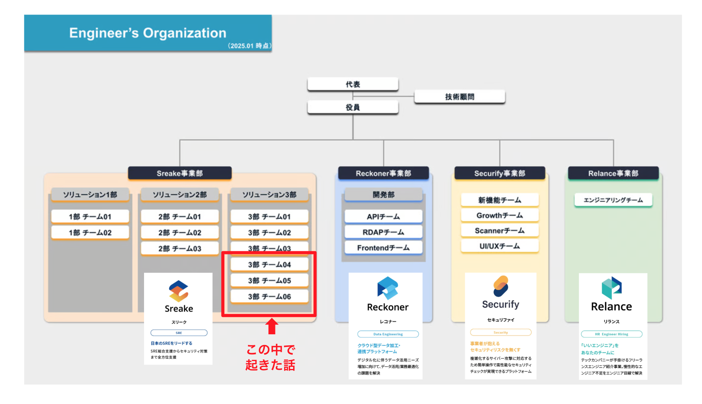
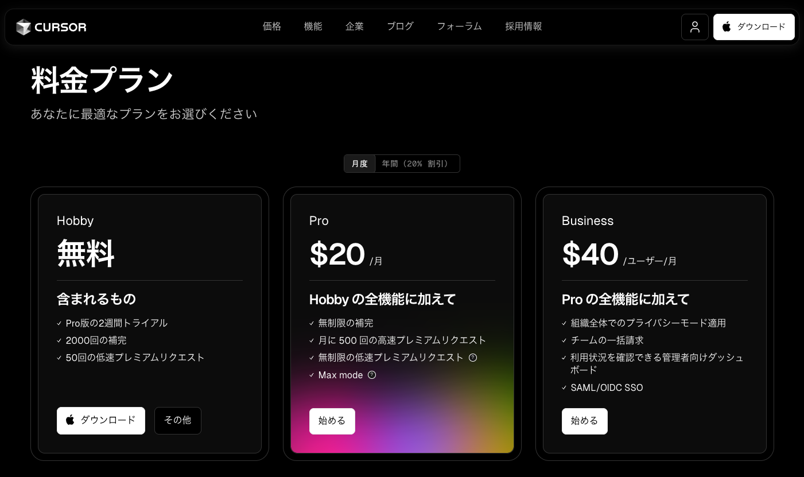
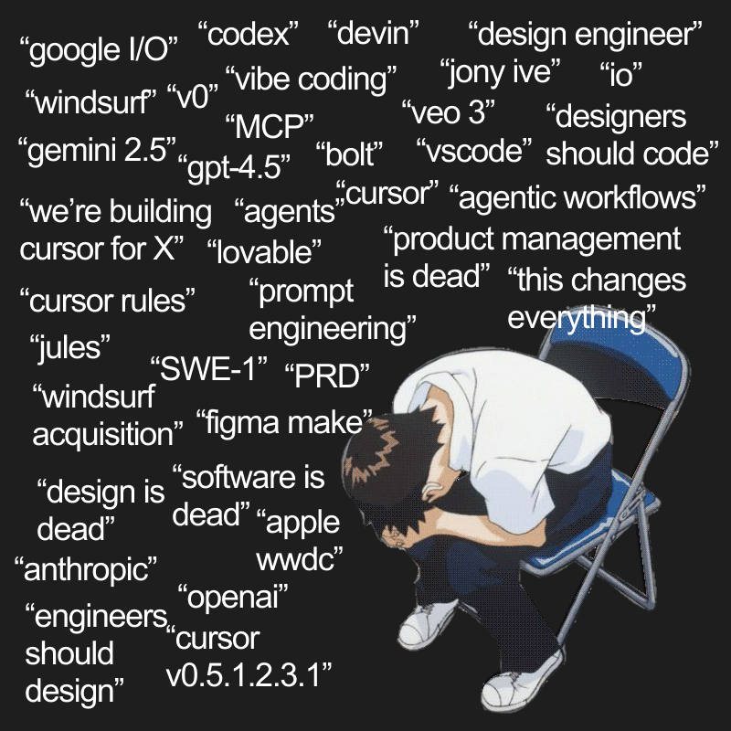
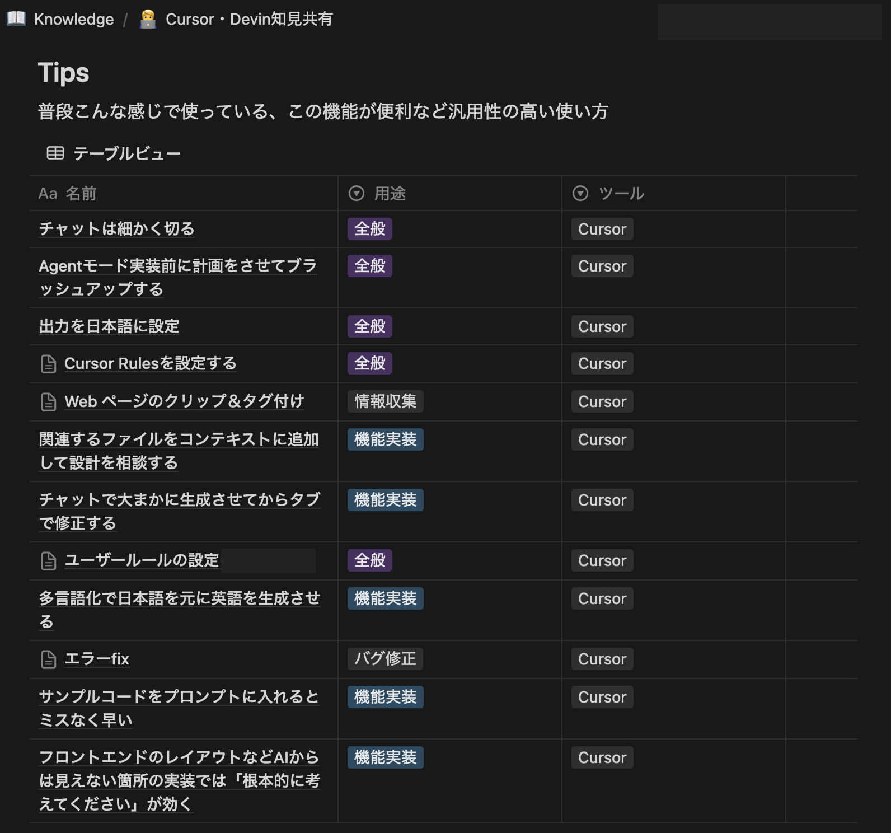
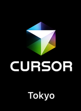

<!-- 
_backgroundColor: #0a1929
_color: white
_class: title dark
-->

# AIコードエディタは開発を変えるか？ Cursorをチームに導入して1ヶ月経った本音

2025/5/28 Qiita Bash 最近ハマっている生成AI活用法を語ろう！ 太田 暢(@iorandd)

---

<!-- _backgroundColor: white -->

## 太田 暢([@iorandd](https://x.com/iorandd))

株式会社スリーシェイク 
SRE伴走型コンサルティングサービス「Sreake」事業部 
アプリケーション開発支援チーム エンジニア

阪神ファン、エニタイムで筋トレ始めて3ヶ月

---

## 本日のスコープ

### 📣 話すこと
- クライアントワークにおける事例
- AIエディタ導入の実体験とチームの適応プロセス

### 🚫 話さないこと
- 自社サービス開発における事例
- AIエディタの機能・コスト比較
- 具体的なコーディング手法や実装例

---

<!-- _header: "" -->
<!-- _class: lead -->

### [弊社サイト](https://jobs-3-shake.com/%e6%a0%aa%e5%bc%8f%e4%bc%9a%e7%a4%be%e3%82%b9%e3%83%aa%e3%83%bc%e3%82%b7%e3%82%a7%e3%82%a4%e3%82%af-%e6%8e%a1%e7%94%a8%e6%83%85%e5%a0%b1%e4%b8%ad%e9%80%94%e3%82%a8%e3%83%b3%e3%82%b8%e3%83%8b%e3%82%a2%e7%b3%bb%e8%81%b7%e7%a8%ae) <strong class="black-text">より</strong>

---

## 🖊️ [Cursor](https://www.cursor.com/ja)について

- Visual Studio Codeをベースにした**AI統合型のコードエディタ**
- プロジェクト全体の**コードベースをインデックス化**し、 自然言語での検索やAIによるコーディングが可能
- Pro・Businessプランでは各種最新モデルを 月500まで**高速リクエスト**可能
- 以降はスローリクエストまたは従量課金
- 新しい[モデル](https://docs.cursor.com/models#models)が使える（最近もclaude-4-sonnetにすぐ対応）
- 無料で使えるモデルも多数  

---

---

## 👨‍💻 Cursorの導入

**導入に至った理由**
- Vibe codingの高まりを踏まえ、アプリケーションチームとしてAI活用推進したい
- 個人契約で使っているエンジニアも多く、導入してほしいという要望

**導入前の環境**
- 原則、各自が好みのエディタを使用（VS Code、Vim/Neovimなど）
- GitHub Copilot Business経由で各種最新モデルを利用可能
- 個人で任意のAIエディタ・エージェントを使用していたメンバーも多数

---

## 💼 懸念点：クライアントワーク

- **少人数単位での案件進行**
  - 案件あたり2-3名単位かつ、複数の業務が並走
- **案件ごとに異なる開発環境**
  - 言語、フレームワークなどが異なる
- **マネージドIDE環境制約**
  - Google Cloud Workstationなどの開発環境制限

---

## 🤖 懸念点：急速なAI環境の変化

- **エンジニア個々の嗜好・習慣**
  - エディタ設定やプラグイン構成の個人最適化
  - [avante.nvim](https://github.com/yetone/avante.nvim)など**各コミュニティAIプラグイン**開発
- **AIコーディングツールの競争激化**
  - [Windsurf](https://windsurf.com/editor)（2024年 11月）
  - VS Code Agent Mode（2025 4月）
  - [Codex](https://openai.com/index/introducing-codex/)（2025年 5月）
  - [Claude Code](https://docs.anthropic.com/ja/docs/claude-code/overview)（2025年 5月）

---

## 🗓️ 1ヶ月後...どうなった？

メンバーにアンケートを依頼

---

## 👍 生産性の向上

- **実装スピード**が早くなった
  - コード補完（tab）
  - 自然言語によるコード生成・編集（Command K）
  - AIチャットによるコード相談・修正（Chatパネル）
- **コードベース全体を対象**とした質問により仕様理解が楽にあった
- **リファクタリングやテスト**の負担が減った
- コーディング以外にも**ドキュメンテーション作成**の補助になった

---

## 🌀 課題

- **機能認知の不足**  機能が多すぎて全てを把握しきれず、なんとなく使いこなせていない感覚に陥る
- **良すぎるUX**  基本機能が直感的で使いやすいため、詳細なドキュメンテーションを参照して 他の機能まで深く掘り下げる必要性を感じにくい
- **学習時間の確保困難**  ツールの具体的な使い方が個人の裁量に任されていたため、体系的な学習機会や サポートが必要という声も

---

## ✅ 実際の浸透過程

- 急激な変化ではなく、1ヶ月かけて**徐々に浸透**
- **社内Notionを活用した知見の蓄積**
  - Tips、案件事例、他社事例リンク、課題・要望
- **複数ツールの併用**
  - Vimと同じフォルダを開き、コードベース全体への 質問など特定の場面でCursorを活用
  - 特定の言語やプロジェクトでのみCursorを使用
    - PythonやTypeScriptはLLM自体の学習が進んでいる説
    - GoやPHPはあんまり？ （rulesをちゃんと書いた方がいいらしい）
    - [Awesome CursorRules](https://github.com/PatrickJS/awesome-cursorrules)

---

## 👀 VS Codeの動向とフォークエディタへの影響

- **VS Codeによる機能追従**
  - Cursor Composer（マルチファイル同時編集機能、2024年7月） ->GitHub Copilot Multi-file editing (2024年10月)
  - Cursor Agent Mode（2024年9月） ->VS Code Agent Mode（2025年4月）
- **基盤 VS Code バージョンの遅延**
  - Cursor は VS Code 1.96（2024 年11月）を基盤としており、 互換性問題も発生
- Microsoft製拡張機能の[**フォークIDE非対応化**](https://github.com/getcursor/cursor/issues/2976?ref=blog.lai.so)（2025年4月）
- VS Code [**GitHub Copilot Chat 拡張 OSS 化**](https://code.visualstudio.com/blogs/2025/05/19/openSourceAIEditor)（2025/5/19発表）

---

## 📝 まとめ

- **AI活用を促すきっかけ**としてのエディタのチーム導入は効果あり
- クライアントワークの特性や、エンジニアファーストの観点から単一AIエディタの 全面導入がマッチするとは限らない
  - 申請は**希望制**にしたり、**複数の選択肢**から選べるようにするのが理想
- 現状ベストは刻々と変わるので**AIツールをどう使い分けるかが重要**

---

## [Cursor Meetup Tokyo](https://aiau.connpass.com/event/353531/)

- 日本初のコミュニティイベント
- 参加者4000名オーバー！
- **日時**: 2025年6月6日（金）18:30〜21:30
- **場所**: 株式会社メルカリ+オンライン

---

<!-- 
_backgroundColor: #0a1929
_color: white
_class: title dark
-->

<!-- タイトルページ左上に大きなロゴを表示 -->

  

# ありがとうございました

### ご質問・ご相談はお気軽にお問い合わせください

@iorandd | https://3-shake.com

 